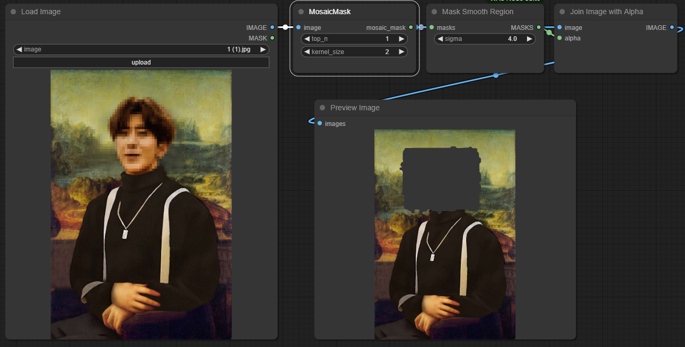

# ComfyUI-Mosaic-Mask

ComfyUI-Mosaic-Mask is an automatic tool designed to detect and mask mosaic areas in input images.

## Features

- Automatically detect mosaic areas in images.
- Mask the detected mosaic areas with customizable grid patterns.

## Installation

To install and use ComfyUI-Mosaic-Mask, follow these steps:

    git clone https://github.com/okgo4/ComfyUI-Mosaic-Mask.git

   
## Usage

Please follow the example.json for a basic template.

The `top_n` parameter controls how many noncontinuous censored areas to be returned (The algorithm will sort the censored parts based on their area).

The `kernel_size` parameter refers to how many pixels to expand upon the censored areas.

## Important

It is worth noting that the `Mask Smooth Region` node is **STRONGLY RECOMMENDED** after the `MosaicMask` node. Otherwise, when sampling an image without smoothed mask, the image may become black.

## Thanks 
Special thanks to the mosasic_detector project: https://github.com/summer4an/mosaic_detector.

